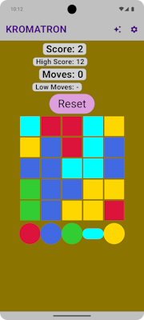
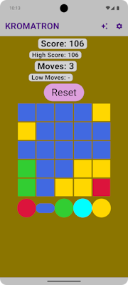
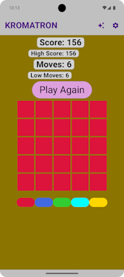

# KROMATRON

&nbsp;&nbsp;&nbsp;&nbsp;

### Overview

Kromatron is an experimental tile-based Android game.
To play, tap colors from the palette at the bottom to flood fill the board from top left until the board is painted a solid color.

This project is an exercise in creating Android apps using Compose-based programming. Experimental features include

* Hinting (tap sparkles icon)
* Board and palette resize (tap gear icon)
* Undo last move (for testing)

### Installation

To install Kromatron, build this project using Android Studio Otter and launch.